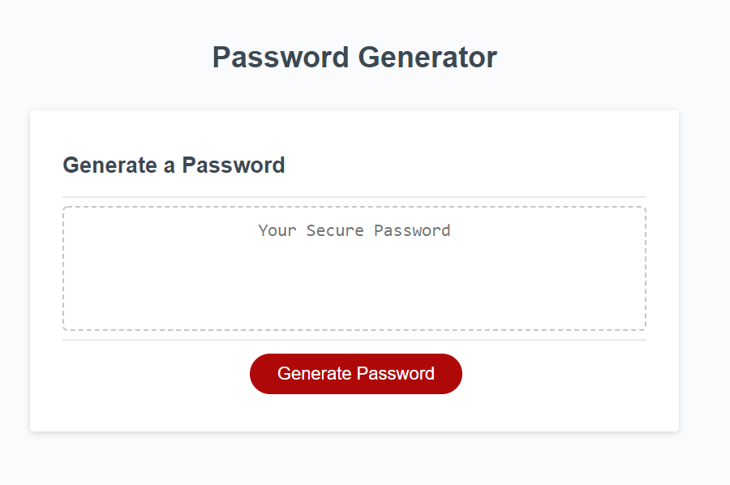
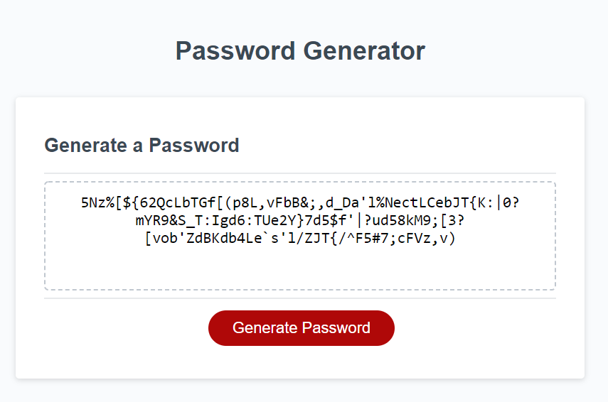

# Password-Generator

## Description
This application produces a random password given criteria provided by the user.  The user has 4 different criteria.  First is the length of the password.  This can be anywhere from 8 to 128 characters.  The second criteria is the type of letters.  The user has the options: uppercase, lowercase, and both uppercase and lowercase.  The third criteria is whether to include numbers in the password.  The fourth and final criteria, is special charcters.  Once all the criteria is chosen, a string is concatonated given the criteria.  From that string, random numbers are chosen in a loop that iterates the number of characters chosen.  This password then displays on the page.  

## Screenshot

